# The--Complete--Github--Actions--and--Workflows--Guide

[Udemy Course Link](https://www.udemy.com/share/102DqF3@2HGIM2z2VoQAKmZTdGdGTqxk019uYQvvPTloZt5Ss8noJMBI7eT51ozLMdESC0TC/)

[GitHub Actions Workflow Documentation](https://docs.github.com/en/actions/writing-workflows)

<!-- markdownlint-disable MD007 -->
<!--ts-->

* [The--Complete--Github--Actions--and--Workflows--Guide](README.md#the--complete--github--actions--and--workflows--guide)
   * [EKS Notes](README.md#eks-notes)
   * [Mermaid](README.md#mermaid)
   * [Dependabot](README.md#dependabot)
   * [Markdown](README.md#markdown)
   * [TODO](README.md#todo)

* [Notes](doc/README.md#notes)
   * [GitHub Codespaces/VSCode](doc/README.md#github-codespacesvscode)
      * [VSCode Extensions](doc/README.md#vscode-extensions)
      * [Manual List](doc/README.md#manual-list)
   * [Renovatebot](doc/README.md#renovatebot)
      * [Ereate PRs in GitHub not Renovate Console](doc/README.md#ereate-prs-in-github-not-renovate-console)
      * [Commit Message](doc/README.md#commit-message)
         * [Default ### Commit Message](doc/README.md#default--commit-message)
         * [Pull Request Title](doc/README.md#pull-request-title)
         * [🏆 WINNER 🏆 PR Title and Description](doc/README.md#-winner--pr-title-and-description)

* [Section 1 - Basic Concepts](section_01/README.md#section-1---basic-concepts)
   * [Section 1.3 - YAML](section_01/README.md#section-13---yaml)
   * [Section 1.4 - First Workflow](section_01/README.md#section-14---first-workflow)
   * [Section 1.5 - Parallel &amp; Dependent Jobs](section_01/README.md#section-15---parallel--dependent-jobs)
   * [Section 1.6 - Managing Workflows](section_01/README.md#section-16---managing-workflows)
   * [Section 1.7 - Debugging Workflows](section_01/README.md#section-17---debugging-workflows)
   * [Section 1.8 - Skipping Workflows](section_01/README.md#section-18---skipping-workflows)
   * [Section 1.9 - Workflow commands](section_01/README.md#section-19---workflow-commands)
   * [Section 1.11 - Working Dirs and Shells](section_01/README.md#section-111---working-dirs-and-shells)
   * [Section 1.12 - Download our repo](section_01/README.md#section-112---download-our-repo)
   * [Section 1.13 - Actions](section_01/README.md#section-113---actions)
   * [Section 1.14 - Actions](section_01/README.md#section-114---actions)

* [Section 2 - Events](section_02/README.md#section-2---events)
   * [Section 2.15 - Events](section_02/README.md#section-215---events)
      * [push](section_02/README.md#push)
      * [pull_request](section_02/README.md#pull_request)
         * [pull request creation](section_02/README.md#pull-request-creation)
         * [pull request merge](section_02/README.md#pull-request-merge)
      * [issue create](section_02/README.md#issue-create)
   * [Section 2.16 - Event Activity Types](section_02/README.md#section-216---event-activity-types)
   * [section 2.17 - Event trigging from forks](section_02/README.md#section-217---event-trigging-from-forks)
   * [section 2.18 - Pull Request Target event](section_02/README.md#section-218---pull-request-target-event)
   * [section 2.19 - workflow_run](section_02/README.md#section-219---workflow_run)
   * [section 2.20 - filter workflow runs by branches, tags, paths](section_02/README.md#section-220---filter-workflow-runs-by-branches-tags-paths)
      * [copilot: Branch Filter Patterns in GitHub Actions](section_02/README.md#copilot-branch-filter-patterns-in-github-actions)
         * [Q: * vs **](section_02/README.md#q--vs-)
         * [A: don't cross /, or do cross /](section_02/README.md#a-dont-cross--or-do-cross-)
   * [section 2.21 - manual trigger](section_02/README.md#section-221---manual-trigger)
      * [cool - postman](section_02/README.md#cool---postman)
   * [section 2.22 - repository dispatch](section_02/README.md#section-222---repository-dispatch)
   * [section 2.23 - scheduled event](section_02/README.md#section-223---scheduled-event)

* [Section 3 - Expressions, Contexts, Etc](section_03/README.md#section-3---expressions-contexts-etc)
   * [Section 3.24 - Expressions and Contexts](section_03/README.md#section-324---expressions-and-contexts)
   * [Section 3.25 - If Key](section_03/README.md#section-325---if-key)
   * [Section 3.26 - Status Checks](section_03/README.md#section-326---status-checks)
   * [Section 3.27 - Environment Variables](section_03/README.md#section-327---environment-variables)

* [Codespaces](doc/codespaces/README.md#codespaces)
   * [GitHub Codespaces/VSCode](doc/codespaces/README.md#github-codespacesvscode)
      * [VSCode Extensions](doc/codespaces/README.md#vscode-extensions)
      * [Manual List](doc/codespaces/README.md#manual-list)

* [Renovatebot](doc/renovatebot/README.md#renovatebot)
   * [Ereate PRs in GitHub not Renovate Console](doc/renovatebot/README.md#ereate-prs-in-github-not-renovate-console)
   * [Commit Message](doc/renovatebot/README.md#commit-message)
      * [Default ### Commit Message](doc/renovatebot/README.md#default--commit-message)
      * [Pull Request Title](doc/renovatebot/README.md#pull-request-title)
      * [🏆 WINNER 🏆 PR Title and Description](doc/renovatebot/README.md#-winner--pr-title-and-description)

<!-- Created by https://github.com/ekalinin/github-markdown-toc -->
<!--te-->

<!-- markdownlint-enable MD007 -->

## EKS Notes

<https://docs.renovatebot.com/modules/versioning/aws-eks-addon/>

## Mermaid

```mermaid

%% Repository Structure
graph LR;
    %% Double vertical spacing
    classDef doubledSpacing height:60px;
    ROOT["/ (root)"]:::doubledSpacing
    ROOT --> ._GITHUB[".github/"]:::doubledSpacing
    ._GITHUB --> ..GITHUB_RENOVATEJSON["renovate.json"]:::doubledSpacing
    ._GITHUB --> ..GITHUB_WORKFLOWS["workflows/"]:::doubledSpacing
    ..GITHUB_WORKFLOWS --> ..GITHUBWORKFLOWS_CHECKOUTYML["checkout.yml"]:::doubledSpacing
    ..GITHUB_WORKFLOWS --> ..GITHUBWORKFLOWS_CONTEXTSYML["contexts.yml"]:::doubledSpacing
    ..GITHUB_WORKFLOWS --> ..GITHUBWORKFLOWS_DELETEPRERELEASESSH["delete-prereleases.sh"]:::doubledSpacing
    ..GITHUB_WORKFLOWS --> ..GITHUBWORKFLOWS_DELETEPRERELEASESYML["delete-prereleases.yml"]:::doubledSpacing
    ..GITHUB_WORKFLOWS --> ..GITHUBWORKFLOWS_EVENTSYML["events.yml"]:::doubledSpacing
    ..GITHUB_WORKFLOWS --> ..GITHUBWORKFLOWS_EXTERNALYML["external.yml"]:::doubledSpacing
    ..GITHUB_WORKFLOWS --> ..GITHUBWORKFLOWS_FIRSTWORKFLOWYML["first-workflow.yml"]:::doubledSpacing
    ..GITHUB_WORKFLOWS --> ..GITHUBWORKFLOWS_GITHUBMARKDOWNTOCYML["github-markdown-toc.yml"]:::doubledSpacing
    ..GITHUB_WORKFLOWS --> ..GITHUBWORKFLOWS_MANUALYML["manual.yml"]:::doubledSpacing
    ..GITHUB_WORKFLOWS --> ..GITHUBWORKFLOWS_MERMAIDYML["mermaid.yml"]:::doubledSpacing
    ..GITHUB_WORKFLOWS --> ..GITHUBWORKFLOWS_PRCOMMENTYML["pr-comment.yml"]:::doubledSpacing
    ..GITHUB_WORKFLOWS --> ..GITHUBWORKFLOWS_S0328ENVYML["s03-28-env.yml"]:::doubledSpacing
    ..GITHUB_WORKFLOWS --> ..GITHUBWORKFLOWS_SEMANTICPRERELEASEYML["semantic-prerelease.yml"]:::doubledSpacing
    ..GITHUB_WORKFLOWS --> ..GITHUBWORKFLOWS_SEMANTICRELEASEYML["semantic-release.yml"]:::doubledSpacing
    ..GITHUB_WORKFLOWS --> ..GITHUBWORKFLOWS_SIMPLEACTIONYML["simple-action.yml"]:::doubledSpacing
    ..GITHUB_WORKFLOWS --> ..GITHUBWORKFLOWS_STALEYML["stale.yml"]:::doubledSpacing
    ..GITHUB_WORKFLOWS --> ..GITHUBWORKFLOWS_STATUSYML["status.yml"]:::doubledSpacing
    ..GITHUB_WORKFLOWS --> ..GITHUBWORKFLOWS_WORKFLOWCOMMANDSYML["workflow-commands.yml"]:::doubledSpacing
    ..GITHUB_WORKFLOWS --> ..GITHUBWORKFLOWS_WORKFLOWRUNYML["workflow-run.yml"]:::doubledSpacing
    ..GITHUB_WORKFLOWS --> ..GITHUBWORKFLOWS_WORKINGDIRSANDSHELLSYML["working-dirs-and-shells.yml"]:::doubledSpacing
    ROOT --> ._READMEMD["README.md"]:::doubledSpacing
    ROOT --> ._DOC["doc/"]:::doubledSpacing
    ._DOC --> .DOC_READMEMD["README.md"]:::doubledSpacing
    ._DOC --> .DOC_CODESPACES["codespaces/"]:::doubledSpacing
    .DOC_CODESPACES --> .DOCCODESPACES_READMEMD["README.md"]:::doubledSpacing
    ._DOC --> .DOC_RENOVATEBOT["renovatebot/"]:::doubledSpacing
    .DOC_RENOVATEBOT --> .DOCRENOVATEBOT_READMEMD["README.md"]:::doubledSpacing
    .DOC_RENOVATEBOT --> .DOCRENOVATEBOT_MENDRENOVATESETTINGSPNG["mend-renovate-settings.png"]:::doubledSpacing
    .DOC_RENOVATEBOT --> .DOCRENOVATEBOT_PRSETTINGSPNG["pr-settings.png"]:::doubledSpacing
    .DOC_RENOVATEBOT --> .DOCRENOVATEBOT_RENOVATECONFIGPNG["renovate-config.png"]:::doubledSpacing
    ROOT --> ._SECTION_01["section_01/"]:::doubledSpacing
    ._SECTION_01 --> .SECTION_01_READMEMD["README.md"]:::doubledSpacing
    ._SECTION_01 --> .SECTION_01_APPJS["app.js"]:::doubledSpacing
    ._SECTION_01 --> .SECTION_01_CONVERTJS["convert.js"]:::doubledSpacing
    ._SECTION_01 --> .SECTION_01_INPUTYAML["input.yaml"]:::doubledSpacing
    ._SECTION_01 --> .SECTION_01_OUTPUTJSON["output.json"]:::doubledSpacing
    ._SECTION_01 --> .SECTION_01_PACKAGELOCKJSON["package-lock.json"]:::doubledSpacing
    ._SECTION_01 --> .SECTION_01_PACKAGEJSON["package.json"]:::doubledSpacing
    ROOT --> ._SECTION_02["section_02/"]:::doubledSpacing
    ._SECTION_02 --> .SECTION_02_READMEMD["README.md"]:::doubledSpacing
    ._SECTION_02 --> .SECTION_02_PACKAGELOCKJSON["package-lock.json"]:::doubledSpacing
    ._SECTION_02 --> .SECTION_02_PACKAGEJSON["package.json"]:::doubledSpacing
    ._SECTION_02 --> .SECTION_02_UPDATEMERMAIDGRAPHJS["update-mermaid-graph.js"]:::doubledSpacing
    ROOT --> ._SECTION_03["section_03/"]:::doubledSpacing
    ._SECTION_03 --> .SECTION_03_READMEMD["README.md"]:::doubledSpacing
    ROOT --> ._UTIL["util/"]:::doubledSpacing
    ._UTIL --> .UTIL_DERENOVATESH["de-renovate.sh"]:::doubledSpacing
    ._UTIL --> .UTIL_PROTECTEDBRANCHPSH["protected-branch-p.sh"]:::doubledSpacing
```

## Dependabot

interesting to see dependabot flag the issue.  when
I added a known-to-be-out-of-date dev dependency to
package-lock.json, renovate picked it up right away

as soon as I merged the renovate PR, dependabot closed the issue

slick

<https://github.com/allenhub-net/The--Complete--Github--Actions--and--Workflows--Guide/security/dependabot/3>

## Markdown

* two blank spaces at the end of a line of text yields a line break

## TODO

TODO: create a workflow/action that ensures PRs to /main will trigger a semantic release

