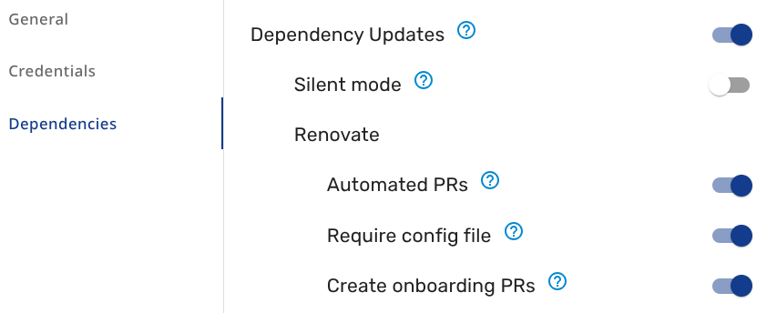
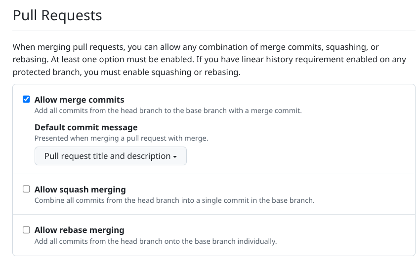
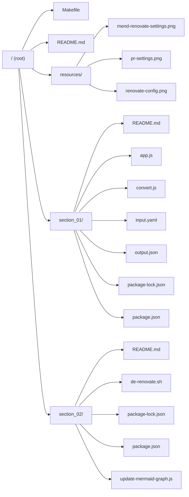

# The--Complete--Github--Actions--and--Workflows--Guide

[Udemy Course Link](https://www.udemy.com/share/102DqF3@2HGIM2z2VoQAKmZTdGdGTqxk019uYQvvPTloZt5Ss8noJMBI7eT51ozLMdESC0TC/)

<!-- markdownlint-disable MD007 -->
<!--ts-->

* [The--Complete--Github--Actions--and--Workflows--Guide](README.md#the--complete--github--actions--and--workflows--guide)
   * [Renovatebot](README.md#renovatebot)
      * [create PRs in github not renovate console](README.md#create-prs-in-github-not-renovate-console)
      * [Commit message](README.md#commit-message)
         * [Default message](README.md#default-message)
         * [Pull Request Title](README.md#pull-request-title)
         * [🏆 WINNER 🏆 PR Title and description](README.md#-winner--pr-title-and-description)
   * [EKS Notes](README.md#eks-notes)
   * [Mermaid](README.md#mermaid)
   * [Dependabot](README.md#dependabot)
   * [Markdown](README.md#markdown)
   * [TODO](README.md#todo)

* [Section 1 - Basic Concepts](section_01/README.md#section-1---basic-concepts)
   * [Section 1.3 - YAML](section_01/README.md#section-13---yaml)
   * [Section 1.4 - First Workflow](section_01/README.md#section-14---first-workflow)
   * [Section 1.5 - Parallel &amp; Dependent Jobs](section_01/README.md#section-15---parallel--dependent-jobs)
   * [Section 1.6 - Managing Workflows](section_01/README.md#section-16---managing-workflows)
   * [Section 1.7 - Debugging Workflows](section_01/README.md#section-17---debugging-workflows)
   * [Section 1.8 - Skipping Workflows](section_01/README.md#section-18---skipping-workflows)
   * [Section 1.9 - Workflow commands](section_01/README.md#section-19---workflow-commands)
   * [Section 1.11 - Working Dirs and Shells](section_01/README.md#section-111---working-dirs-and-shells)
   * [Section 1.12 - Download our repo](section_01/README.md#section-112---download-our-repo)
   * [Section 1.13 - Actions](section_01/README.md#section-113---actions)
   * [Section 1.14 - Actions](section_01/README.md#section-114---actions)

* [Section 2 - Events](section_02/README.md#section-2---events)
   * [Section 2.15 - Events](section_02/README.md#section-215---events)
      * [push](section_02/README.md#push)
      * [pull_request](section_02/README.md#pull_request)
         * [pull request creation](section_02/README.md#pull-request-creation)
         * [pull request merge](section_02/README.md#pull-request-merge)
      * [issue create](section_02/README.md#issue-create)
   * [Section 2.16 - Event Activity Types](section_02/README.md#section-216---event-activity-types)
   * [section 2.17 - Event trigging from forks](section_02/README.md#section-217---event-trigging-from-forks)
   * [section 2.18 - Pull Request Target event](section_02/README.md#section-218---pull-request-target-event)
   * [section 2.19 - workflow_run](section_02/README.md#section-219---workflow_run)
   * [section 2.20 - filter workflow runs by branches, tags, paths](section_02/README.md#section-220---filter-workflow-runs-by-branches-tags-paths)
      * [copilot: Branch Filter Patterns in GitHub Actions](section_02/README.md#copilot-branch-filter-patterns-in-github-actions)
         * [Q: * vs **](section_02/README.md#q--vs-)
         * [A: don't cross /, or do cross /](section_02/README.md#a-dont-cross--or-do-cross-)
   * [section 2.21 - manual trigger](section_02/README.md#section-221---manual-trigger)
      * [cool - postman](section_02/README.md#cool---postman)
   * [section 2.22 - repository dispatch](section_02/README.md#section-222---repository-dispatch)
   * [section 2.23 - scheduled event](section_02/README.md#section-223---scheduled-event)

<!-- Created by https://github.com/ekalinin/github-markdown-toc -->
<!--te-->

<!-- markdownlint-enable MD007 -->

## Renovatebot

### create PRs in github not renovate console

🦠 renovate web service by default will create the dependency dashboard in the
 web console (the "developer console"), and not in a github issue.
  I found it difficult to find this setting based on naming.

"Silent Mode" seems to be the culprait, as least as far as naming clarity is concerned.

1. go to "SETTINGS"  
   

1. Selection "Dependencies"

1. Configure

   

   * ✅ Dependency Updates
   * ❌ Silent Mode
   * Renovate
     * ✅ Automated PRs
     * ✅ Require config file
     * ✅ Create onboarding PRs

### Commit message

#### Default message

doesn't trigger semantic release the
way I want

#### Pull Request Title

seems good

#### 🏆 WINNER 🏆 PR Title and description

includes the branch and (clickable) PR number in the commit summary

## EKS Notes

<https://docs.renovatebot.com/modules/versioning/aws-eks-addon/>

## Mermaid

```mermaid

%% Repository Structure
graph LR;
    %% Double vertical spacing
    classDef doubledSpacing height:60px;
    ROOT["/ (root)"]:::doubledSpacing
    ROOT --> ._MAKEFILE["Makefile"]:::doubledSpacing
    ROOT --> ._READMEMD["README.md"]:::doubledSpacing
    ROOT --> ._RESOURCES["resources/"]:::doubledSpacing
    ._RESOURCES --> .RESOURCES_MENDRENOVATESETTINGSPNG["mend-renovate-settings.png"]:::doubledSpacing
    ._RESOURCES --> .RESOURCES_PRSETTINGSPNG["pr-settings.png"]:::doubledSpacing
    ._RESOURCES --> .RESOURCES_RENOVATECONFIGPNG["renovate-config.png"]:::doubledSpacing
    ROOT --> ._SECTION_01["section_01/"]:::doubledSpacing
    ._SECTION_01 --> .SECTION_01_READMEMD["README.md"]:::doubledSpacing
    ._SECTION_01 --> .SECTION_01_APPJS["app.js"]:::doubledSpacing
    ._SECTION_01 --> .SECTION_01_CONVERTJS["convert.js"]:::doubledSpacing
    ._SECTION_01 --> .SECTION_01_INPUTYAML["input.yaml"]:::doubledSpacing
    ._SECTION_01 --> .SECTION_01_OUTPUTJSON["output.json"]:::doubledSpacing
    ._SECTION_01 --> .SECTION_01_PACKAGELOCKJSON["package-lock.json"]:::doubledSpacing
    ._SECTION_01 --> .SECTION_01_PACKAGEJSON["package.json"]:::doubledSpacing
    ROOT --> ._SECTION_02["section_02/"]:::doubledSpacing
    ._SECTION_02 --> .SECTION_02_READMEMD["README.md"]:::doubledSpacing
    ._SECTION_02 --> .SECTION_02_DERENOVATESH["de-renovate.sh"]:::doubledSpacing
    ._SECTION_02 --> .SECTION_02_PACKAGELOCKJSON["package-lock.json"]:::doubledSpacing
    ._SECTION_02 --> .SECTION_02_PACKAGEJSON["package.json"]:::doubledSpacing
    ._SECTION_02 --> .SECTION_02_UPDATEMERMAIDGRAPHJS["update-mermaid-graph.js"]:::doubledSpacing
```

## Dependabot

interesting to see dependabot flag the issue.  when
I added a known-to-be-out-of-date dev dependency to
package-lock.json, renovate picked it up right away

as soon as I merged the renovate PR, dependabot closed the issue

slick

<https://github.com/allenhub-net/The--Complete--Github--Actions--and--Workflows--Guide/security/dependabot/3>

## Markdown

* two blank spaces at the end of a line of text yields a line break

## TODO

TODO: create a workflow/action that ensures PRs to /main will trigger a semantic release
