# Mermaid

<!-- markdownlint-disable MD007 -->
<!--ts-->
* [Mermaid](#mermaid)
   * [Repository Map](#repository-map)
<!--te-->
<!-- markdownlint-enable MD007 -->

## Repository Map

<!-- markdownlint-disable MD033 -->

<table>
    <tr>
        <td style="border:none;">See:</td>
        <td/>
    </tr>
    <tr>
        <td style="border:none;"></td>
        <td style="border:none;"><a href="../../section_02/update-mermaid-graph.js">Mermaid Graph Generator</a></td>
    </tr>
    <tr>
        <td style="border:none;"></td>
        <td style="border:none;"><a href="../../.github/workflows/mermaid.yml">GitHub Mermaid Workflow</a></td>
    </tr>
</table>

<!-- markdownlint-enable MD033 -->

---

```mermaid

%% Repository Structure
graph LR;
    %% Double vertical spacing
    classDef doubledSpacing height:60px;
    ROOT["/ (root)"]:::doubledSpacing
    ROOT --> ._GITHUB[".github/"]:::doubledSpacing
    ._GITHUB --> ..GITHUB_RENOVATEJSON["renovate.json"]:::doubledSpacing
    ._GITHUB --> ..GITHUB_WORKFLOWS["workflows/"]:::doubledSpacing
    ..GITHUB_WORKFLOWS --> ..GITHUBWORKFLOWS_CHECKOUTYML["checkout.yml"]:::doubledSpacing
    ..GITHUB_WORKFLOWS --> ..GITHUBWORKFLOWS_CONTEXTSYML["contexts.yml"]:::doubledSpacing
    ..GITHUB_WORKFLOWS --> ..GITHUBWORKFLOWS_DELETEPRERELEASESSH["delete-prereleases.sh"]:::doubledSpacing
    ..GITHUB_WORKFLOWS --> ..GITHUBWORKFLOWS_DELETEPRERELEASESYML["delete-prereleases.yml"]:::doubledSpacing
    ..GITHUB_WORKFLOWS --> ..GITHUBWORKFLOWS_EVENTSYML["events.yml"]:::doubledSpacing
    ..GITHUB_WORKFLOWS --> ..GITHUBWORKFLOWS_EXTERNALYML["external.yml"]:::doubledSpacing
    ..GITHUB_WORKFLOWS --> ..GITHUBWORKFLOWS_FIRSTWORKFLOWYML["first-workflow.yml"]:::doubledSpacing
    ..GITHUB_WORKFLOWS --> ..GITHUBWORKFLOWS_GITHUBMARKDOWNTOCYML["github-markdown-toc.yml"]:::doubledSpacing
    ..GITHUB_WORKFLOWS --> ..GITHUBWORKFLOWS_MANUALYML["manual.yml"]:::doubledSpacing
    ..GITHUB_WORKFLOWS --> ..GITHUBWORKFLOWS_MERMAIDYML["mermaid.yml"]:::doubledSpacing
    ..GITHUB_WORKFLOWS --> ..GITHUBWORKFLOWS_PRCOMMENTYML["pr-comment.yml"]:::doubledSpacing
    ..GITHUB_WORKFLOWS --> ..GITHUBWORKFLOWS_S0328ENVYML["s03-28-env.yml"]:::doubledSpacing
    ..GITHUB_WORKFLOWS --> ..GITHUBWORKFLOWS_SEMANTICPRERELEASEYML["semantic-prerelease.yml"]:::doubledSpacing
    ..GITHUB_WORKFLOWS --> ..GITHUBWORKFLOWS_SEMANTICRELEASEYML["semantic-release.yml"]:::doubledSpacing
    ..GITHUB_WORKFLOWS --> ..GITHUBWORKFLOWS_SIMPLEACTIONYML["simple-action.yml"]:::doubledSpacing
    ..GITHUB_WORKFLOWS --> ..GITHUBWORKFLOWS_STALEYML["stale.yml"]:::doubledSpacing
    ..GITHUB_WORKFLOWS --> ..GITHUBWORKFLOWS_STATUSYML["status.yml"]:::doubledSpacing
    ..GITHUB_WORKFLOWS --> ..GITHUBWORKFLOWS_WORKFLOWCOMMANDSYML["workflow-commands.yml"]:::doubledSpacing
    ..GITHUB_WORKFLOWS --> ..GITHUBWORKFLOWS_WORKFLOWRUNYML["workflow-run.yml"]:::doubledSpacing
    ..GITHUB_WORKFLOWS --> ..GITHUBWORKFLOWS_WORKINGDIRSANDSHELLSYML["working-dirs-and-shells.yml"]:::doubledSpacing
    ROOT --> ._READMEMD["README.md"]:::doubledSpacing
    ROOT --> ._DOC["doc/"]:::doubledSpacing
    ._DOC --> .DOC_CODESPACES["codespaces/"]:::doubledSpacing
    .DOC_CODESPACES --> .DOCCODESPACES_READMEMD["README.md"]:::doubledSpacing
    ._DOC --> .DOC_RENOVATEBOT["renovatebot/"]:::doubledSpacing
    .DOC_RENOVATEBOT --> .DOCRENOVATEBOT_READMEMD["README.md"]:::doubledSpacing
    .DOC_RENOVATEBOT --> .DOCRENOVATEBOT_MENDRENOVATESETTINGSPNG["mend-renovate-settings.png"]:::doubledSpacing
    .DOC_RENOVATEBOT --> .DOCRENOVATEBOT_PRSETTINGSPNG["pr-settings.png"]:::doubledSpacing
    .DOC_RENOVATEBOT --> .DOCRENOVATEBOT_RENOVATECONFIGPNG["renovate-config.png"]:::doubledSpacing
    ROOT --> ._SECTION_01["section_01/"]:::doubledSpacing
    ._SECTION_01 --> .SECTION_01_READMEMD["README.md"]:::doubledSpacing
    ._SECTION_01 --> .SECTION_01_APPJS["app.js"]:::doubledSpacing
    ._SECTION_01 --> .SECTION_01_CONVERTJS["convert.js"]:::doubledSpacing
    ._SECTION_01 --> .SECTION_01_INPUTYAML["input.yaml"]:::doubledSpacing
    ._SECTION_01 --> .SECTION_01_OUTPUTJSON["output.json"]:::doubledSpacing
    ._SECTION_01 --> .SECTION_01_PACKAGELOCKJSON["package-lock.json"]:::doubledSpacing
    ._SECTION_01 --> .SECTION_01_PACKAGEJSON["package.json"]:::doubledSpacing
    ROOT --> ._SECTION_02["section_02/"]:::doubledSpacing
    ._SECTION_02 --> .SECTION_02_READMEMD["README.md"]:::doubledSpacing
    ._SECTION_02 --> .SECTION_02_PACKAGELOCKJSON["package-lock.json"]:::doubledSpacing
    ._SECTION_02 --> .SECTION_02_PACKAGEJSON["package.json"]:::doubledSpacing
    ._SECTION_02 --> .SECTION_02_UPDATEMERMAIDGRAPHJS["update-mermaid-graph.js"]:::doubledSpacing
    ROOT --> ._SECTION_03["section_03/"]:::doubledSpacing
    ._SECTION_03 --> .SECTION_03_READMEMD["README.md"]:::doubledSpacing
    ROOT --> ._UTIL["util/"]:::doubledSpacing
    ._UTIL --> .UTIL_DERENOVATESH["de-renovate.sh"]:::doubledSpacing
    ._UTIL --> .UTIL_PROTECTEDBRANCHPSH["protected-branch-p.sh"]:::doubledSpacing
```

