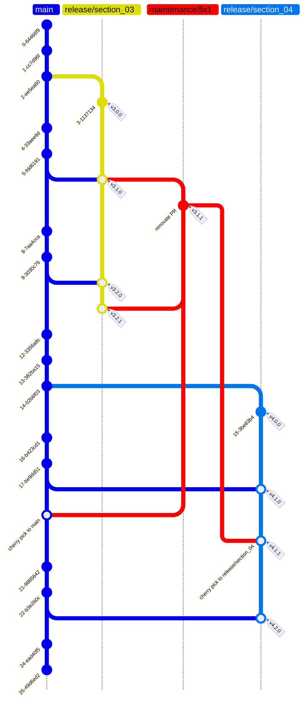

# Release Flow

<!-- markdownlint-disable -->
<!--ts-->
* [Release Flow](#release-flow)
   * [References](#references)
   * [Diagram Release Flow](#diagram-release-flow)
      * [Q: please diagram "release flow" as shown here: <a href="https://devblogs.microsoft.com/devops/release-flow-how-we-do-branching-on-the-vsts-team/" rel="nofollow">Release Flow - How We Do Branching on the VSTS Team</a>](https://devblogs.microsoft.com/devops/release-flow-how-we-do-branching-on-the-vsts-team/)
   * [Release Flow for Udemy](#release-flow-for-udemy)
      * [How to Read the Diagram](#how-to-read-the-diagram)
      * [Diagram Notes](#diagram-notes)
   * [For This Course](#for-this-course)
   * [Release Flow Discovery](#release-flow-discovery)
<!--te-->
<!-- markdownlint-enable  -->

## References

[http://releaseflow.org/](http://releaseflow.org/)

[Release Flow - How We Do Branching on the VSTS Team](https://devblogs.microsoft.com/devops/release-flow-how-we-do-branching-on-the-vsts-team/)

## Diagram Release Flow

### Q: please diagram "release flow" as shown here: [Release Flow - How We Do Branching on the VSTS Team](https://devblogs.microsoft.com/devops/release-flow-how-we-do-branching-on-the-vsts-team/)

**me**:
please diagram "release flow" as shown here:
[Release Flow: How We Do Branching on the VSTS Team](https://devblogs.microsoft.com/devops/release-flow-how-we-do-branching-on-the-vsts-team/)

please use mermaid, gitgraph, top-down

---

### How to Read the Diagram

* `main` is your mainline branch.
* `release/section_03` and `release/section_04` are long-lived section branches.
* Each `commit` on a section branch represents a completed chapter.
* `Tags` (e.g., `v3.1.0`, `v4.2.0`) are automatically created by
semantic-release after each chapter merge.
* You can patch chapters by merging fixes into the section branch, and
semantic-release will create a new patch tag.

### Diagram Notes

* Each `release/section_*` branch is long-lived.
* Each chapter completion is a commit.
* Each tag (e.g., `v3.1.0`) is created by `semantic-release` after merging a chapter.
* You can extend this for more sections/chapters as needed.

## For This Course

## Release Flow Discovery

[Release Flow - How We Do Branching on the VSTS Team](https://devblogs.microsoft.com/devops/release-flow-how-we-do-branching-on-the-vsts-team/)
