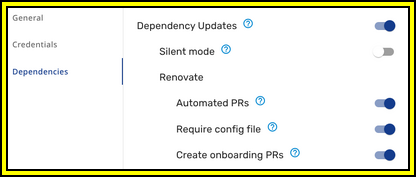
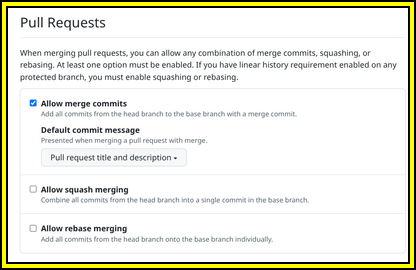

# Renovatebot

<!-- markdownlint-disable MD007 -->
<!--ts-->
* [Renovatebot](#renovatebot)
   * [Create PRs in GitHub not Renovate Console](#create-prs-in-github-not-renovate-console)
   * [Commit Message](#commit-message)
      * [Default Commit Message](#default-commit-message)
      * [Pull Request Title](#pull-request-title)
      * [🏆 WINNER 🏆 PR Title and Description](#-winner--pr-title-and-description)
   * [Update Reusable Workflows](#update-reusable-workflows)
      * [How to make Renovate propose workflow version bumps](#how-to-make-renovate-propose-workflow-version-bumps)
<!--te-->
<!-- markdownlint-enable MD007 -->

## Create PRs in GitHub not Renovate Console

🦠 renovate web service by default will create the dependency dashboard in the
 web console (the "developer console"), and not in a github issue.
  I found it difficult to find this setting based on naming.

"Silent Mode" seems to be the culprait, as least as far as naming clarity is concerned.

1. go to "SETTINGS"  

   

1. Selection "Dependencies"

1. Configure

   [](renovate-config.png)

   * ✅ Dependency Updates
   * ❌ Silent Mode
   * Renovate
     * ✅ Automated PRs
     * ✅ Require config file
     * ✅ Create onboarding PRs

## Commit Message

[](pr-settings.png)

### Default Commit Message

doesn't trigger semantic release the
way I want.  

[See the `semantic-release` #what-actually-triggers-a-semantic-release](../semantic-release/README.md#what-actually-triggers-a-semantic-release)

### Pull Request Title

seems good

### 🏆 WINNER 🏆 PR Title and Description

includes the branch and (clickable) PR number in the commit summary

## Update Reusable Workflows

<!-- markdownlint-disable -->
**me**:  
I am using renovatebot to keep my github actions up to date.  
I recently published: https://github.com/allenhub-net/TCGAaWGuide-a/releases/tag/v1.1.1
but renovate is not generating a PR from the existing v1.1.0: https://github.com/allenhub-net/The--Complete--Github--Actions--and--Workflows--Guide/blob/main/.github/workflows/using-reusable-workflows.yml

my config is here: https://github.com/allenhub-net/The--Complete--Github--Actions--and--Workflows--Guide/blob/main/.github/renovate.json

how I can configure renovate to create a PR for upgrading from v1.1.0 to v1.1.1
<!-- markdownlint-enable -->

**ChatGPT**:  
Renovate currently does not automatically update version tags
in reusable workflows declared as:

```yaml
uses: owner/repo/.github/workflows/workflow.yml@v1.1.0
```

Even though a GitHub issue (#12212) opened on June 4, 2023 has
proposed support for this, it's not merged and not available yet

### How to make Renovate propose workflow version bumps

**NB**: hosted renovate caches for ~30 minutes, so rapid
iteration of a reusable workflow will _appear_ to not work.
This _may_ lead to hours of frenzied debugging of a config
which works just fine.  

**ChatGPT**:  
**Add a** `regexManager` **for workflows**  
You can teach Renovate to detect `uses:` tags inside
`.github/workflows/...` files and treat them like GitHub
Release tags. Here's a starting point:

```json
{
  "extends": ["config:base"],
  "regexManagers": [
    {
      "fileMatch": ["^\\.github/workflows/.*\\.ya?ml$"],
      "matchStrings": [
        "uses: (?<depName>[^@]+)@(?<currentValue>v\\d+\\.\\d+\\.\\d+)"
      ],
      "datasourceTemplate": "github-tags",
      "packageNameTemplate": "{{depName}}",
      "versioningTemplate": "semver",
      "extractVersionTemplate": "{{currentValue}}"
    }
  ]
}
```

This config:

* Scans your reusable-workflow YAML files,

* Captures `depName` (e.g. `allenhub-net/TCGAaWGuide-a`) and `currentValue` (`v1.1.0`),

* Checks GitHub tags for newer versions (e.g. v1.1.1),

Opens PRs updating the `uses:` line.

You'll need to tweak the regex if your tags don't start with a v,
or include commit SHA references.
