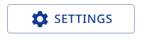

# Renovatebot

<!-- markdownlint-disable MD007 -->
<!--ts-->
* [Renovatebot](#renovatebot)
   * [Create PRs in GitHub not Renovate Console](#create-prs-in-github-not-renovate-console)
   * [Commit Message](#commit-message)
      * [Default Commit Message](#default-commit-message)
      * [Pull Request Title](#pull-request-title)
      * [🏆 WINNER 🏆 PR Title and Description](#-winner--pr-title-and-description)
<!--te-->
<!-- markdownlint-enable MD007 -->

## Create PRs in GitHub not Renovate Console

🦠 renovate web service by default will create the dependency dashboard in the
 web console (the "developer console"), and not in a github issue.
  I found it difficult to find this setting based on naming.

"Silent Mode" seems to be the culprait, as least as far as naming clarity is concerned.

1. go to "SETTINGS"  

   

1. Selection "Dependencies"

1. Configure

   

   * ✅ Dependency Updates
   * ❌ Silent Mode
   * Renovate
     * ✅ Automated PRs
     * ✅ Require config file
     * ✅ Create onboarding PRs

## Commit Message

### Default Commit Message

doesn't trigger semantic release the
way I want.  

[See the `semantic-release` #what-actually-triggers-a-semantic-release](../semantic-release/README.md#what-actually-triggers-a-semantic-release)

### Pull Request Title

seems good

### 🏆 WINNER 🏆 PR Title and Description

includes the branch and (clickable) PR number in the commit summary

