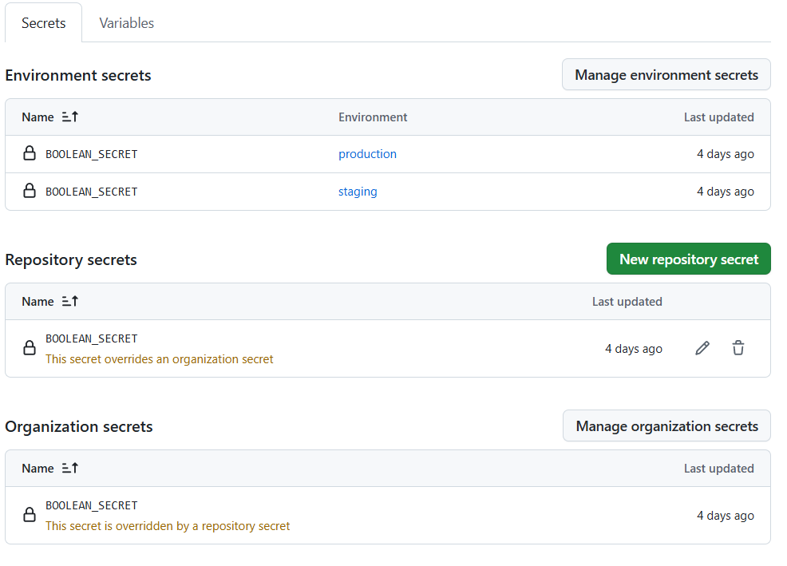

# Section 3 - Expressions, Contexts, Etc

[Udemy Course Link](https://www.udemy.com/share/102DqF3@2HGIM2z2VoQAKmZTdGdGTqxk019uYQvvPTloZt5Ss8noJMBI7eT51ozLMdESC0TC/)

<!-- markdownlint-disable MD007 -->
<!--ts-->
* [Section 3 - Expressions, Contexts, Etc](#section-3---expressions-contexts-etc)
   * [Section 3.24 - Expressions and Contexts](#section-324---expressions-and-contexts)
   * [Section 3.25 - If Key](#section-325---if-key)
   * [Section 3.26 - Status Checks](#section-326---status-checks)
   * [Section 3.27 - Environment Variables](#section-327---environment-variables)
   * [Section 3.28 - Dynamic Variables](#section-328---dynamic-variables)
   * [Section 3.29 - Configuration Variables and Secrets](#section-329---configuration-variables-and-secrets)
<!--te-->
<!-- markdownlint-enable MD007 -->

## Section 3.24 - Expressions and Contexts

[GitHub Actions: Evaluate Expressions in Workflows and Actions](https://docs.github.com/en/actions/writing-workflows/choosing-what-your-workflow-does/evaluate-expressions-in-workflows-and-actions)

`${{ }}` github evaluation syntax

* literals
* operators
* call functions
* access objects (context)
  * in workflow, automatically have contexts
    * `github`
    * `inputs`
    * `steps`
    * `secrets`

interesting:

```text
2025-06-16 14:57:20.746 [info] [CODE REFERENCING] file:///workspaces/The--Complete--Github--Actions--and--Workflows--Guide/.github/workflows/contexts.yml Similar code with 1 license type [unknown] https://github.com/github-copilot/code_referencing?cursor=5cb5e419a14e65e6c96b2ab6c5fa00b1,b7ab5adec75f0dc0b86714f8b1d00b6c,c8bbb24d37511c74f4d74aa68847288d,d525b03807e6a4bbc80554887e9e6a8a,d99eb69a719e3820bb2e41fecf5dcf5a,f54ac7ac4f74ec3e9eb816a2f0b03d1a,fc7b55ff91b7ecf5896399f5807e505d&editor=vscode [Ln 14, Col 1] : expressions  id: expressions  run: |  echo ${{ 1 }}  echo ${{ 'thi...
2025-06-16 14:57:21.615 [info] message 0 returned. finish reason: [stop]
```

still getting bitten by developing on a non-default branch

## Section 3.25 - If Key

can put in job level, or step level

with if key, can skip the `${{ }}` syntax and write expression directly

c'mon, guys  
  `if: contains(github.event.issue.labels.*.name, 'bug')`

note: bad advice on quotes from copilot.  copilot wanted double quotes, Ali wants single.

also note: summary steps are alphabetic, not order of appearance :/

## Section 3.26 - Status Checks

[Status Check Functions Documentation](https://docs.github.com/en/actions/writing-workflows/choosing-what-your-workflow-does/evaluate-expressions-in-workflows-and-actions#status-check-functions)

## Section 3.27 - Environment Variables

[Default Environment Variables Documentation](https://docs.github.com/en/actions/writing-workflows/choosing-what-your-workflow-does/store-information-in-variables#default-environment-variables)

`if: github.ref == 'refs/head/main'`  
will work b/c it is evaluated by GHA

`if: $GITHUB_REF == 'refs/head/main'`  
won't work

## Section 3.28 - Dynamic Variables

can define environment variables by writing to a specific file on our runner machine.

the runner machine generates some temporary files used to perform certain actions, like defining environment variables.

see: `GITHUB_ENV`  
path to file we can write to expose new variables

See: [Setting an Environment Variable](https://docs.github.com/en/actions/writing-workflows/choosing-what-your-workflow-does/workflow-commands-for-github-actions#setting-an-environment-variable)

## Section 3.29 - Configuration Variables and Secrets

Configuration variables available at these level

* organization
* repository
* environment

interesting example: RUNNER='ubuntu-latest'

precedence:

* env (highest)
* repo
* org (lowest)

semantic release is being a pain

test1: no feat: commits, but feat: in the PR
result: no release

test2: feat: in commit

final results: it matters what is in the commit - it doesn't matter what's in the PR message

{ style="max-width: 200px; max-height: 200px;" }